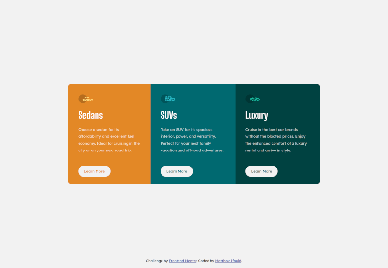

# Frontend Mentor - 3-column preview card component solution

This is a solution to the [3-column preview card component challenge on Frontend Mentor](https://www.frontendmentor.io/challenges/3column-preview-card-component-pH92eAR2-).

Frontend Mentor challenges help you improve your coding skills by building realistic projects.

## Table of contents

-   [Overview](#overview)
    -   [The challenge](#the-challenge)
    -   [Screenshot](#screenshot)
    -   [Links](#links)
-   [My process](#my-process)
    -   [Built with](#built-with)
    -   [What I learned](#what-i-learned)
    -   [Continued development](#continued-development)
    -   [Useful resources](#useful-resources)
-   [Author](#author)
-   [Acknowledgments](#acknowledgments)

## Overview

A simple 1 page design with 3 columns on desktop and a single column on mobile. A small logo and simple typography with a small degree on interactivity in the form of a hover effect on the "Learn More" button.

### The challenge

Users should be able to:

-   View the optimal layout depending on their device's screen size
-   See hover states for interactive elements

### Screenshot

#### Desktop



#### Mobile


### Links

-   Solution URL: [Code](https://github.com/Ifouldm/preview-card-component)
-   Live Site URL: [Live Site](https://github.obidex.com/preview-card-component)

## My process

With the simple design I wrapped each of the components in symantic HTML tags and used a CSS flexbox to provide the mobile layout. I then used a media query to change the flexbox direction for desktop and make some other layout adjustments to suite a larger viewport. I then applied the styles and colours to each of the areas.

### Built with

-   Semantic HTML5 markup
-   CSS custom properties
-   Flexbox
-   Mobile-first workflow

### What I learned

By using the css nth-child selector and css variables I have managed to make the layout expandable, adaptable with complications like transparancy.

```css
.card:nth-child(1) {
    --primaryCol: var(--Brightorange);
}
```

### Useful resources

-   [Nth Child Selector](https://www.w3schools.com/cssref/sel_nth-child.asp)

## Author

-   Website - [Matthew Ifould](https://obidex.com)
-   Frontend Mentor - [@ifouldm](https://www.frontendmentor.io/profile/ifouldm)
-   Github - [ifouldm](https://www.github.com/ifouldm)
